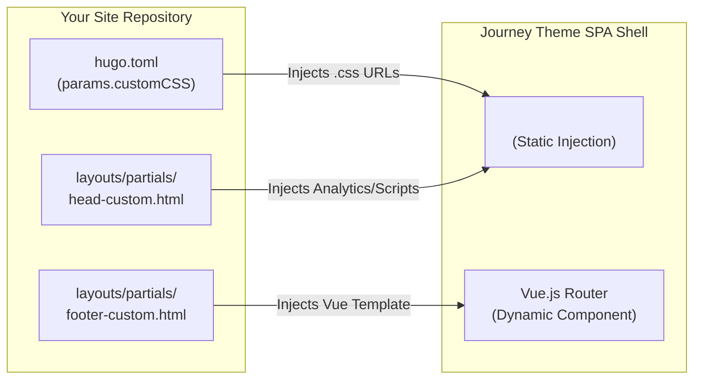

# Journey Theme for Hugo 🚀

Journey is an ultra-modern, **Single Page Application (SPA)** Hugo theme built with Vue.js and Vuetify. It strictly adheres to the **Antigravity Design System (SDD)**, delivering a premium visual experience, fluid page transitions, and robust full-site navigation without page reloads.

## ✨ Core Features

*   **⚡ True SPA Experience**: Intercepts all internal links via Vue Router and asynchronously loads Hugo-generated JSON data using the Fetch API, achieving seamless, flicker-free page transitions.
*   **💎 Antigravity Premium Design**:
    *   **Typography**: Utilizes [Inter](https://fonts.google.com/specimen/Inter) for body text and [Outfit](https://fonts.google.com/specimen/Outfit) for headings, creating a modern and high-end reading experience.
    *   **Glassmorphism**: Elegant blur background effects (`backdrop-filter`) applied to the App Bar and Footer.
    *   **Micro-animations**: Features interactive float effects (`hover-lift`) on article cards and smooth entry animations (`fade-up`) on page load.
*   **🌐 Internationalization (i18n)**: Built-in custom i18n module. All UI text is translatable, and user language preferences are persisted in `localStorage`.
*   **🎨 Multiple Theme Personalities**: Includes various curated color schemes (Vibrant, Sunset, Forest, Ocean, Nordic, Espresso) along with full Light/Dark mode support.
*   **🏷️ Dynamic Tag Cloud**: Automatically calculates the weight of Tags and Series based on post count, dynamically adjusting their visual size and color.
*   **🧪 Hybrid Injection Architecture**: A unique synergy where Hugo Partial Templates define Vue.js component structures. Users MAY inject custom logic and UI elements (like commenting systems or hero banners) via standard Hugo HTML partials without a JavaScript build step.
*   **🖼️ Rich Media Support**: Seamlessly supports dedicated "Featured Images" for posts and high-end rendering (rounded corners, soft shadows, responsive scaling) for standard Markdown embedded images.

---

## 🛠️ Installation & Configuration

As a standard Hugo theme, Journey separates theme logic from your site's content. We have provided an `exampleSite` directory to demonstrate how a working project is structured.

### The `exampleSite` MANDATORY Usage
Journey officially enforces the `exampleSite` directory as its definitive feature showcase. 
*   **Mandatory Demonstration**: It is MANDATED to demonstrate **all** available theme features, UI components, and markdown styling capabilities.
*   **Living Documentation**: `exampleSite` MUST be continuously updated to reflect new capabilities. It serves as the visual and structural baseline.

### Running the Example Site
To test the theme locally and interact with the mandatory feature showcase:
1. Navigate to the `exampleSite` directory:
   ```bash
   cd exampleSite
   ```
2. Run the Hugo server. You MUST explicitly tell it where to find the theme:
   ```bash
   hugo server --themesDir ../..
   ```

### Using in Your Project
When installing this theme in your own Hugo project, your root `hugo.toml` **MUST** include the following output formats, as this theme relies on Hugo acting as a JSON API server:

```toml
theme = 'journey'

# Ensure Hugo generates JSON files for all required pages
[outputs]
  taxonomy = ['JSON']
  term     = ['JSON']
  home     = ['HTML', 'JSON', 'SEARCHINDEX']
  page     = ['JSON']
  section  = ['JSON']

# Define Social Links (Used by the custom footer injection)
[params.social]
  github = "https://github.com/your-username"
  twitter = "https://twitter.com/your-username"
  linkedin = "https://linkedin.com/your-username"
  facebook = "" # Keys with empty strings will be automatically hidden

# Comments (optional) — defaults to Disqus via Dynamic Component Injection
[params.disqus]
  shortname = "your-disqus-shortname"
  scope = ["/posts/"]   # optional: defaults to ["/posts/"] if omitted

# Markup Renderer (optional) — enable only if your Markdown uses raw HTML
# The theme defaults to Hugo's safe renderer (unsafe = false).
[markup]
  [markup.goldmark]
    [markup.goldmark.renderer]
      unsafe = true
```

> **Alternative: Override the JSON layout in your own site**
>
> Since Journey outputs content as JSON (not HTML), you MAY also control what gets included by overriding the theme's `layouts/_default/single.json` in your own site. Your site's layouts always take priority over the theme:
>
> Create `layouts/_default/single.json` in your own site root:
> ```
> {{- dict "title" .Title "content" .Content "date" (.Date.Format "2006-01-02") | jsonify (dict "indent" "  " "noHTMLEscape" true) -}}
> ```
> **`noHTMLEscape: true`** prevents `jsonify` from escaping HTML characters in the output (`<` stays as `<` instead of `\u003c`). This is especially useful for the `content` field, which is passed to Vue's `v-html` — while Vue automatically handles both forms, unescaped HTML keeps the JSON payload readable and avoids any edge-case double-decode issues.
>
> The `unsafe` flag in your `hugo.toml` controls whether raw HTML blocks in Markdown are included in `.Content` at all. `noHTMLEscape` only affects how the JSON encodes what is already in `.Content`.

---

## ✍️ Writing Guideline (Code-as-Doc)

To accelerate your content creation, we provide a definitive "Code-as-Doc" template. 

👉 **[View and Copy the WRITING-TEMPLATE.md](./WRITING-TEMPLATE.md)**

You MAY simply copy the contents of this template into your `content/posts/` directory whenever you create a new article. It includes the standard Front Matter format and examples of how Journey renders Markdown elements.

### Front Matter Properties

Every article placed in `content/posts/` supports the following Front Matter attributes:

```toml
+++
title = 'Your Post Title'
date = 2023-10-27T10:00:00+08:00
draft = false
tags = ['Tag1', 'Tag2']
series = ['Series Name']
# Featured Image (Optional): Displayed on the homepage card and as a hero image in the post
image = 'https://example.com/cover.jpg'
+++
```

### Embedded Images & Media

You MAY freely embed images within your Markdown content using standard syntax. `antigravity.css` automatically optimizes these images for a premium look:

```markdown

```

**Visual Enhancements for Embedded Images:**
*   Automatically scales to fit the screen without overflowing (`max-width: 100%`).
*   Features premium `16px` rounded corners.
*   Includes a refined, soft bottom shadow (`box-shadow`) to create depth.
*   Automatically maintains comfortable spacing from surrounding text for optimal readability.

---

## 🎨 Quick Customization

Journey provides the following structured personalization points:

- **Change Colors**: Open `static/css/antigravity.css` and modify the `:root` CSS variables.
- **Change Logo/Title**: Update `title` in your `hugo.toml`. The SPA will automatically pick it up.
- **Navigation**: Modify the `[[menus.main]]` section in your `hugo.toml` to add or remove header links.
- **Custom CSS**: MAY inject your own stylesheets by adding them to the `customCSS` array in `[params]` within `hugo.toml`.
- **Custom Code Hooks**:
    - `layouts/partials/head-custom.html`: For static head injections (like Analytics).
    - `layouts/partials/home-banner-custom.html`: For a fully custom hero banner on the homepage.
    - `layouts/partials/footer-custom.html`: For dynamic footer elements (like the Social bar).
    MANDATORY READING: [Development Guide (GUIDE.md)](./GUIDE.md) for architectural details and SDD mandates.

### Hybrid Injection Architecture
The theme provides safe, high-flexibility override points without touching the core code. It leverages a "Macro + Micro" injection strategy where Hugo prepares the static shell and Vue.js dynamically "claims" templates and emits events for custom logic.



---

## 💬 Comments (Dynamic Injection)

Journey follows a **Theme Core Cleanliness** philosophy: the core engine MUST remain agnostic to specific third-party providers. Instead of hardcoding services like Disqus, the theme uses **Event-Driven Dynamic Injection**. This allows you to swap it out for Giscus, Utterances, or any other provider by simply overriding a Hugo HTML partial—**no Vue or JavaScript building required**.

To enable a commenting system, you MUST:
1.  Configure the provider in your `hugo.toml`.
2.  Override the `layouts/partials/comments-template.html` partial to include your provider's logic.

### Example: Integrated Disqus Reference
The theme includes a reference Disqus implementation in the `exampleSite`. To use it in your project:

**1. Update your `hugo.toml`:**
```toml
[params.disqus]
  shortname = "your-disqus-shortname"
  scope = ["/posts/"]   # optional: paths where comments appear
```

**2. Create `layouts/partials/comments-template.html` in your site root:**
```html
<script type="text/x-template" id="comments-template">
  <!-- The container element that your provider targets -->
  <div class="mt-12 pt-6" style="border-top: 1px solid rgba(128,128,128,0.2);">
    <div id="disqus_thread"></div>
  </div>
</script>

<script>
  // The theme emits a 'site-comments-load' event on 'window' 
  // whenever a post is loaded or the route changes.
  window.addEventListener('site-comments-load', (event) => {
    const { shortname, pageUrl, pageIdentifier } = event.detail;
    if (!shortname || !document.getElementById('disqus_thread')) return;

    window.disqus_config = function () {
      this.page.url = pageUrl;
      this.page.identifier = pageIdentifier;
    };

    if (window.DISQUS) {
      window.DISQUS.reset({ reload: true, config: window.disqus_config });
      return;
    }

    const script = document.createElement('script');
    script.src = `https://${shortname}.disqus.com/embed.js`;
    script.setAttribute('data-timestamp', String(Date.now()));
    script.async = true;
    (document.head || document.body).appendChild(script);
  });
</script>
```

*   **Zero Performance Impact**: If no `shortname` is provided or the partial is not overridden with script logic, the SPA will not load any external scripts.
*   **Data-Driven**: Changing scoped paths or identifiers requires **no theme code changes**.

For architectural details on how to inject your own custom commenting provider, see [GUIDE.md § 8](./GUIDE.md).

---

## ⚙️ Architecture & Specifications

Journey utilizes a **Headless Hugo** strategy:
1.  **Hugo's Role**: Hugo is solely responsible for compiling Markdown into structured **JSON APIs** (`list.json`, `single.json`) and generating a single entry point (`index.html`).
2.  **Vue.js's Role**: Once the browser loads `index.html`, Vue.js takes over routing (`PostView.js`, `HomeView.js`) and fetches the corresponding `index.json` to render the view.

**Key Directories & Files:**
*   `layouts/index.html`: The SPA shell and single entry point.
*   `layouts/_default/single.json`: JSON output template for single posts.
*   `layouts/home.json`: JSON output template for the homepage list and global `config`.
*   `static/js/`: Core frontend application logic (`App.js`, `main.js`, Router, i18n).
*   `static/css/antigravity.css`: The core stylesheet defining all premium visual effects.

---

## 👨‍💻 Customization & Development

> [!IMPORTANT]
> **Mandatory Development Rules**: 
> 1. This project strictly requires **SDD (Spec-Driven Development)** driven development. You **MUST** read and adhere to the [Development Guide (GUIDE.md)](./GUIDE.md) before implementing any features or modifications.
> 2. **English-First Policy**: This README and all core documentation files MUST be written entirely in English.
> 3. **ES6+ Style Mandate**: All JavaScript (including inline `<script>` tags) MUST be written in modern ES6+ style.
> 

For advanced modifications, technical specifications (including the Vue/Hugo SPA architecture), and rules for contributing to this theme, please refer to the dedicated [Development Guide (GUIDE.md)](./GUIDE.md). This guide includes our strict mandates for feature documentation within the `exampleSite`.

