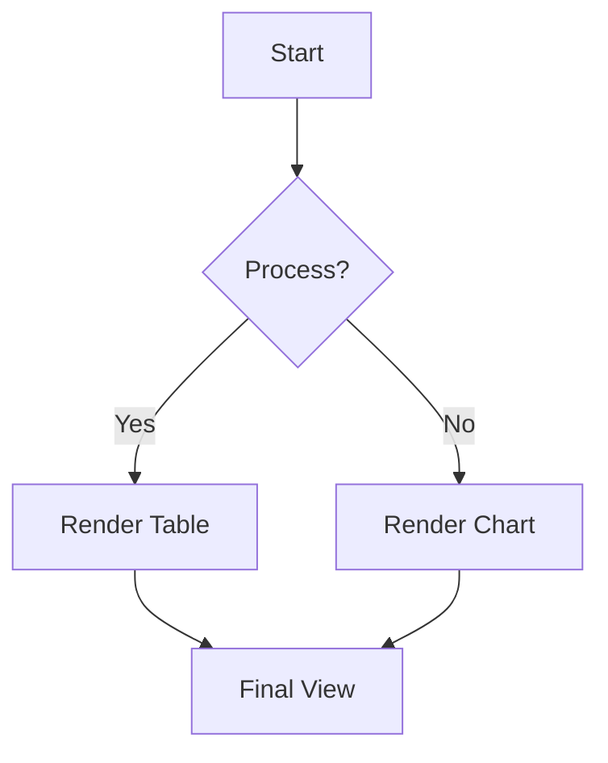
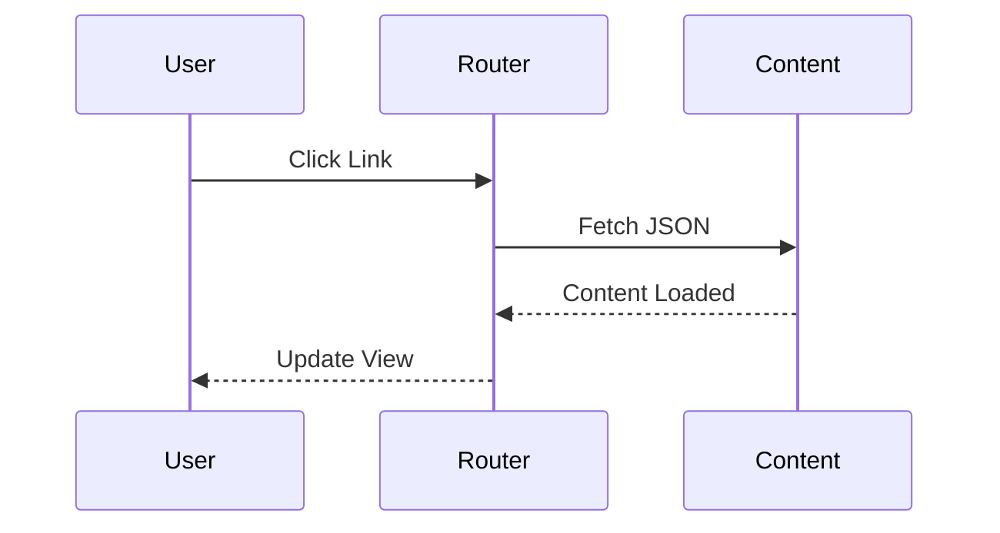
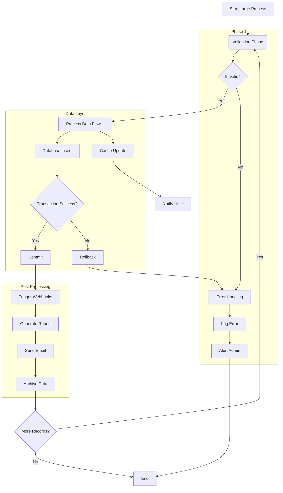

+++
title = 'Comprehensive Feature Showcase'
date = 2024-01-01T12:00:00+08:00
draft = false
tags = ['Showcase', 'Typography', 'UI', 'Markdown']
series = ['Getting Started']
image = 'https://images.unsplash.com/photo-1618005182384-a83a8bd57fbe?auto=format&fit=crop&q=80&w=2000'
+++

This post serves as the comprehensive demonstration of the **Journey** theme's design system and Markdown rendering capabilities. It is designed to showcase all non-API-dependent features natively supported by the theme.

## 1. Premium Typography (Outfit & Inter)

The theme utilizes **Outfit** for headings and **Inter** for body text, ensuring high legibility and a modern, premium aesthetic.

### Heading Level 3
#### Heading Level 4
##### Heading Level 5
###### Heading Level 6

This is a standard paragraph demonstrating the Inter font family. Sed ut perspiciatis unde omnis iste natus error sit voluptatem accusantium doloremque laudantium, totam rem aperiam, eaque ipsa quae ab illo inventore veritatis et quasi architecto beatae vitae dicta sunt explicabo. 

## 2. Text Formatting & Inline Elements

You can easily use **bold text**, *italic text*, and ~~strikethrough~~.
For technical writers, `inline code snippets` are styled with a distinct background to stand out from regular text. 

Here is a link to the [Hugo Documentation](https://gohugo.io).

## 3. Blockquotes & Callouts

Blockquotes are styled with the theme's primary color to serve as elegant callouts or citations.

> "Design is not just what it looks like and feels like. Design is how it works." 
> — Steve Jobs

## 4. Embedded Media (Images)

Embedded Markdown images are automatically enhanced with the Antigravity design system, featuring responsive scaling, 16px rounded corners, and a soft depth shadow.


## 5. Structured Data (Lists & Tables)

### Unordered List
*   **True SPA Architecture**: Zero-refresh navigation.
*   **Glassmorphism**: Premium blurred UI layers.
*   **Dark Mode**: Native semantic color scaling.

### Ordered List
1.  Initialize the Hugo project.
2.  Configure `hugo.toml` for JSON outputs.
3.  Write amazing content.

### Tables

Tables in Journey feature a premium glassmorphic aesthetic, subtle zebra striping, and are fully responsive.

| Project Phase | Deliverable | Status | Priority | Progress |
| :--- | :--- | :--- | :--: | :--: |
| **Research** | Market Analysis | ✅ Done | High | 100% |
| **Design** | UI/UX Mockups | ✅ Done | Medium | 100% |
| **Development** | Core Engine | 🚧 In Progress | Critical | 45% |
| **Deployment** | Production Push | ⏳ Pending | High | 0% |

> [!TIP]
> Tables automatically trigger horizontal scrolling on mobile devices to protect the layout's integrity.

## 6. Code Blocks

Journey provides clear, refined syntax highlighting for various programming languages, ensuring technical content is easy to digest.

### JavaScript
```javascript
// Dynamic theme detection snippet
const isDark = () => document.documentElement.classList.contains('v-theme--dark');
console.log(`Current theme: ${isDark() ? 'Dark' : 'Light'}`);
```

### Python
```python
def fibonacci(n):
    """Generate a fibonacci sequence."""
    a, b = 0, 1
    for _ in range(n):
        yield a
        a, b = b, a + b

print(list(fibonacci(5)))
```

> [!TIP]
> Fenced code blocks support line numbers and highlighting specific lines via Hugo's standard attributes.

## 7. Mermaid Diagrams

The Journey theme provides native, SPA-compatible support for Mermaid diagrams, ensuring high-quality visualizations that respect theme mode changes.

### 7.1 Flowcharts


### 7.2 Sequence Diagrams


### 7.3 Complex Flowcharts (Lightbox Demo)


---

*This showcase will be continuously updated as new features are integrated into the Journey theme.*
